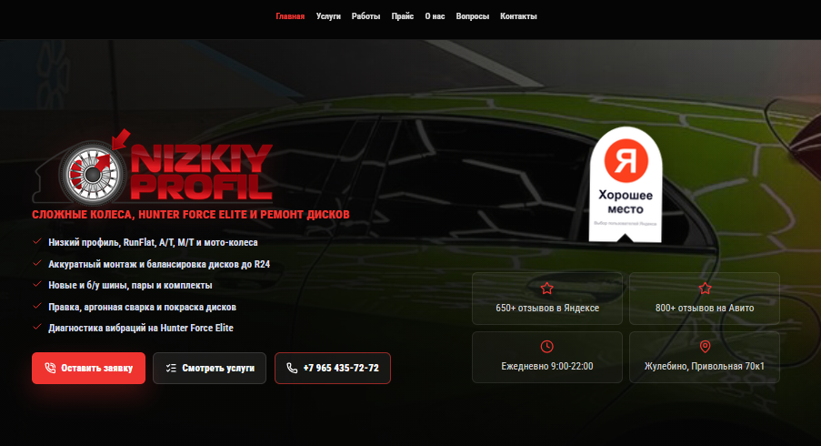
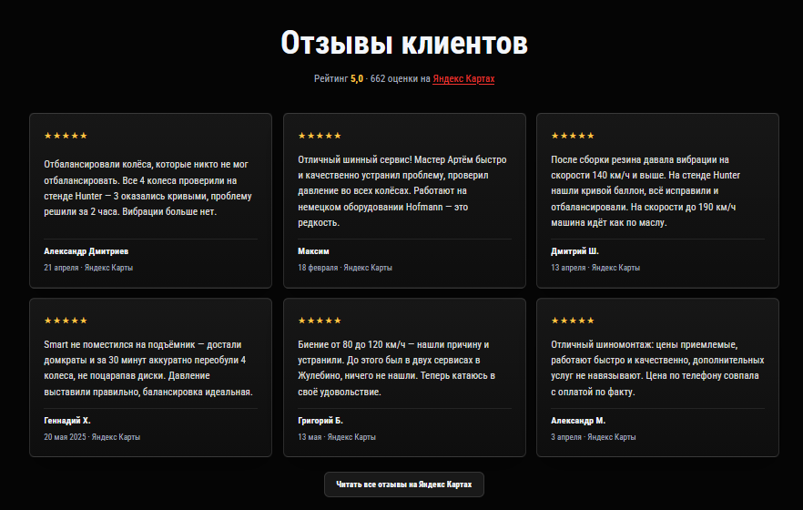
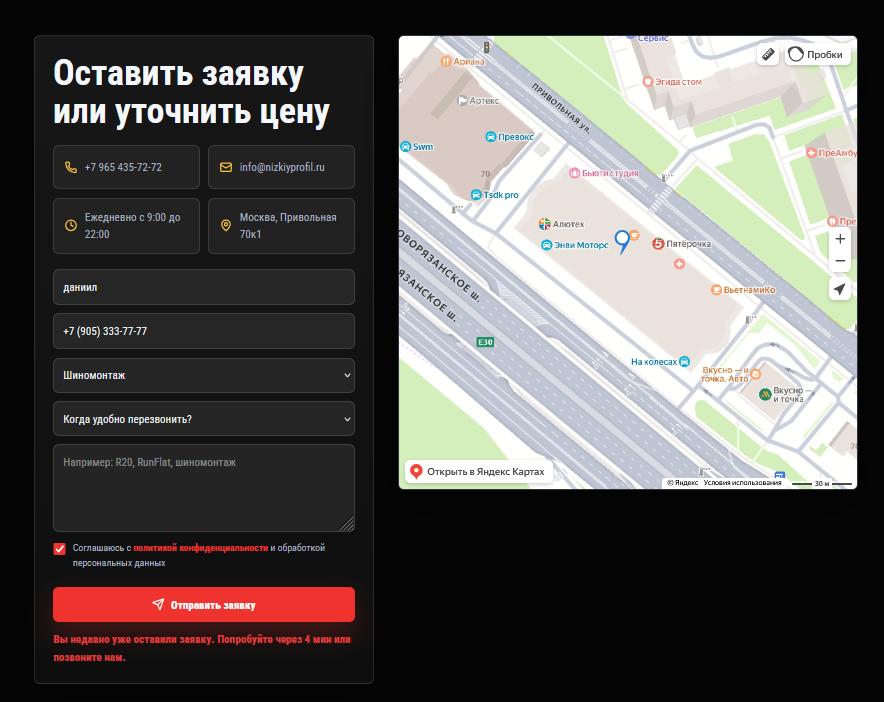
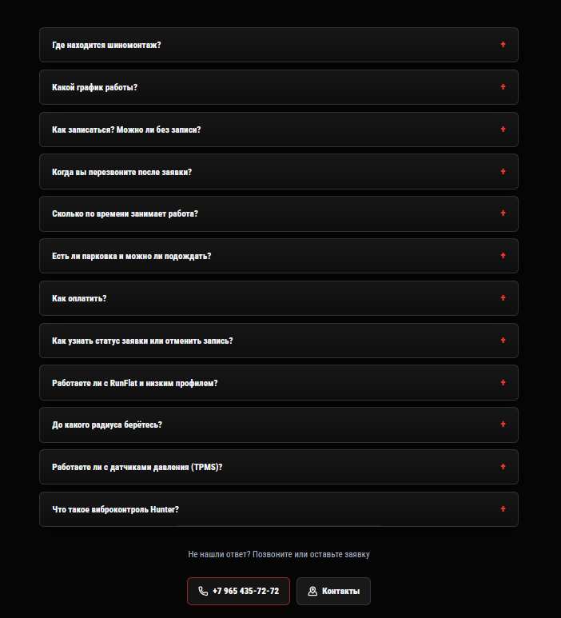
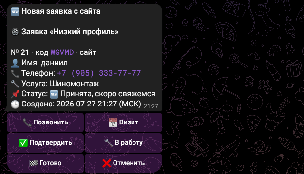
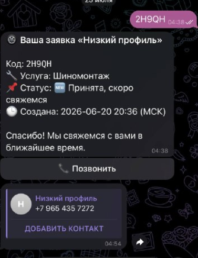

# Низкий профиль

Сайт и бэкенд шиномонтажа в Жулебино (Москва): многостраничный лендинг, форма онлайн-записи и Telegram-бот для заявок и отслеживания статуса.

**Домен:** [nizkiyprofil.ru](https://nizkiyprofil.ru) — пока на нём **прошлый сайт**. Код в этом репозитории — новая версия (ещё не выкатана на домен).

### Скриншоты текущего сайта на домене

| Главная | Отзывы |
|---|---|
|  |  |

| Заявка / контакты | FAQ |
|---|---|
|  |  |

### Telegram-бот

| Владелец (новая заявка + статусы) | Клиент (статус по коду) |
|---|---|
|  |  |

---

## О проекте

Клиент оставляет заявку на сайте → сервер сохраняет её и сразу уведомляет владельца в Telegram. Клиент получает код и может проверить статус через бота. Владелец управляет записями из меню бота: ручная запись, визит, статусы. Сайт оптимизирован под локальное SEO (Жулебино / Москва).

---

## Стек технологий

### Frontend
| Технология | Назначение |
|---|---|
| **HTML5** | Многостраничный сайт (услуги, прайс, галерея, FAQ, контакты) |
| **CSS3** | Адаптивная вёрстка, анимации, mobile-first |
| **JavaScript (Vanilla)** | Форма записи, cookie-баннер, Яндекс.Метрика, UI |

### Backend
| Технология | Назначение |
|---|---|
| **Python 3.12** | Язык сервера |
| **Flask** | Веб-сервер, раздача статики, REST API заявок |
| **flask-cors** | CORS только для своего домена и localhost |
| **Gunicorn** | WSGI-сервер в production |
| **python-dotenv** | Конфигурация через `.env` |

### Интеграции
| Технология | Назначение |
|---|---|
| **Telegram Bot API** (`pyTelegramBotAPI`) | Уведомления владельцу, меню записи, статус для клиента |
| **Яндекс.Метрика** | Аналитика (после согласия на cookie) |
| **JSON-хранилище** | Заявки без отдельной БД (потокобезопасный файл) |
| **Напоминания** | Фоновая проверка визитов (лог + Telegram; SMS — заглушка под SMS.ru) |

### SEO и контент
- Динамические meta / Open Graph / JSON-LD при отдаче HTML
- `sitemap.xml` и `robots.txt`
- Страницы услуг под поисковые запросы (шиномонтаж, Hunter, правка дисков и др.)

### DevOps / деплой
| Технология | Назначение |
|---|---|
| **Docker** + **Docker Compose** | Контейнеризация приложения |
| **nginx** | Reverse proxy, HTTPS |
| **Let's Encrypt** | SSL-сертификаты |
| **Fly.io** | Альтернативный деплой (`fly.toml`) |
| **VPS (Ubuntu)** | Production (Timeweb / Beget / Selectel и т.п.) |

### AI / knowledge graph
| Технология | Назначение |
|---|---|
| **[Graphify](https://github.com/Graphify-Labs/graphify)** | Локальный knowledge graph кодовой базы для Cursor (AST + связи файлов) |
| **tree-sitter** | Парсинг Python/JS при построении графа |
| **NetworkX** | Хранение и обход графа (`graphify-out/graph.json`) |
| **MCP** (`graphify.serve`) | Инструменты `query` / `path` / `explain` для агента в Cursor |

Граф лежит в `graphify-out/` (`graph.html`, `GRAPH_REPORT.md`, `graph.json`).  
Правило Cursor: `.cursor/rules/graphify.mdc`.

---

## Возможности

### Сайт и записи
- Форма онлайн-записи с антиспамом (тайминг, honeypot, rate limit по IP/телефону)
- Клиент сразу получает **код заявки** и ссылку в Telegram
- Cookie-consent перед загрузкой аналитики
- Адаптивный дизайн (desktop / mobile)

### Telegram-бот — владелец
- Уведомление о новой заявке с кнопками статуса и «позвонить клиенту»
- Меню: **новая запись**, список заявок, **назначить визит**, отмена
- Поиск заявки по коду или по пересланному контакту клиента

### Telegram-бот — клиент
- Статус по **коду** с сайта (deep-link `/start CODE`)
- Если код потерян — кнопка **«Поделиться номером»**: Telegram подтверждает,
  что номер принадлежит отправителю (номер текстом намеренно не принимается)
- Кнопка «Позвонить» в сервис

### Напоминания
- Фоновая проверка визитов за N часов (настройка `REMINDER_HOURS`)
- Пока без SMS: запись в лог + уведомление владельцу; готовность к SMS.ru

### Безопасность
- Flask отдаёт **только** публичные страницы и `assets/` — не корень репозитория
  (`/server/bookings.json`, `.env`, логи и исходники снаружи недоступны)
- Rate limit опирается на `X-Real-IP` от nginx, а не на подделываемый `X-Forwarded-For`
- CORS ограничен своим доменом и localhost (`CORS_ORIGINS` в `.env` при необходимости)
- nginx: deny для `/server/`, служебных папок, dotfiles и опасных расширений
- `/api/health` отвечает только `{"ok":true}` без деталей конфигурации

---

## Структура проекта

```
NIZKIPROF/
|-- index.html, *.html      # страницы сайта
|-- styles.css, script.js   # стили и клиентская логика
|-- assets/                 # изображения, логотип
|-- docs/
|   `-- screenshots/        # скриншоты сайта для README
|-- server/
|   |-- app.py              # Flask: сайт + API
|   |-- bot.py              # Telegram-бот (владелец + клиент)
|   |-- store.py            # хранилище заявок (JSON)
|   |-- reminders.py        # напоминания о визите
|   |-- seo.py              # SEO-метаданные
|   `-- config.py           # настройки из .env
|-- deploy/                 # nginx и скрипты VPS
|-- graphify-out/           # knowledge graph (Graphify)
|-- Dockerfile
|-- docker-compose.yml
`-- requirements.txt
```

---

## Быстрый старт (локально)

1. Скопируйте `.env.example` → `.env` и заполните `BOT_TOKEN`, `OWNER_CHAT_ID`, `BOT_USERNAME`.
2. Создайте виртуальное окружение и установите зависимости:

```bash
python -m venv .venv
.venv\Scripts\activate          # Windows
pip install -r requirements.txt
```

3. Запуск:

```bash
cd server
python app.py
```

Сайт: `http://127.0.0.1:5000`

### Docker

```bash
docker compose up --build -d
```

Подробный деплой на VPS: [ИНСТРУКЦИЯ-VPS.md](ИНСТРУКЦИЯ-VPS.md)  
Настройка бота: [ИНСТРУКЦИЯ-БОТ.md](ИНСТРУКЦИЯ-БОТ.md)

---

## Для резюме / портфолио

**Роль:** Full-stack разработка (frontend + backend + Telegram + деплой)

**Ключевые навыки на проекте:**
- вёрстка адаптивного лендинга без фреймворков (HTML/CSS/JS);
- REST API на Flask, обработка форм и защита от спама;
- интеграция Telegram Bot API (меню владельца, визиты, статусы, подтверждение номера через contact);
- hardening: whitelist статики, CORS, доверенный IP за reverse proxy, deny в nginx;
- SEO: sitemap, Open Graph, Schema.org / JSON-LD;
- контейнеризация Docker, nginx + SSL на VPS;
- knowledge graph проекта через Graphify (навигация для AI в Cursor).

---

## Лицензия

Проект разработан для сервиса «Низкий профиль». Исходный код в репозитории — для портфолио.
